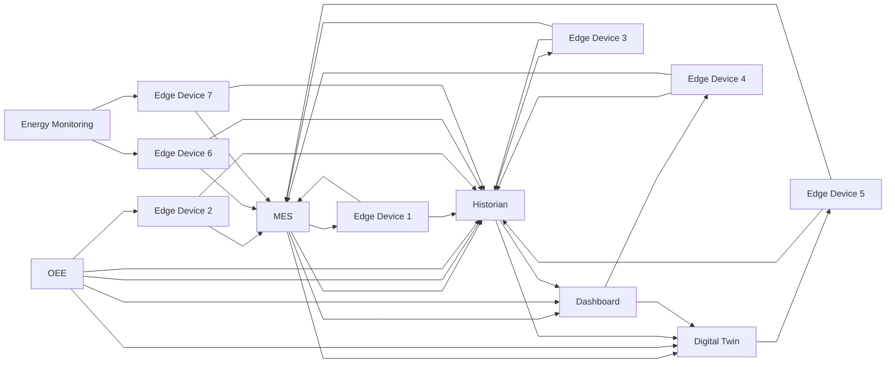
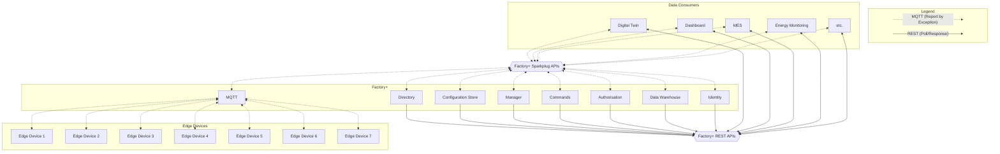
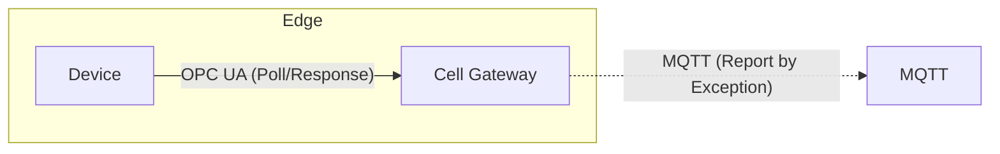

# Overview

Factory+ ultimately establishes a robust, scalable MQTT/Sparkplug pipeline, complete with supporting components, that leverages normalised data models (schemas) and standardised interfaces to consume data. To achieve this end-goal, Factory+ adopts several key principals:

- **MQTT**: The [MQTT](https://mqtt.org/) protocol is a lightweight messaging protocol designed for low-bandwidth, high-latency, or unreliable networks. MQTT does not provide a rich information modelling representation like OPC UA, which historically results in each vendor implementing MQTT in their own way, reducing compatibility and interoperability between devices. This is where Sparkplug (below) comes in.
- **Sparkplug**: [Sparkplug](https://sparkplug.eclipse.org/) is an open-source specification that provides a framework for MQTT-enabled devices and applications to communicate in a standardised manner. It builds on the MQTT specification, defining how best to utilise MQTT in real-time, mission critical industrial applications and addresses many of the limitations of using MQTT in an industrial setting outlined above.
- **Data normalisation**: Normalised [data schemas](/docs/schemas) are utilised for ingested data to ensure consistent data representation across the framework. This promotes interoperability and simplifies data processing and analysis.
- **Standardised interfaces**: Standardised interfaces are used to facilitate communication and data exchange between devices, applications, and components within the framework. This enables seamless integration of new devices and components and reduces the complexity of managing the overall architecture.
- **Modular architecture**: Factory+ is based on the principal of a [modular architecture](/docs/framework-components/component-overview), allowing for easy expansion and customisation of the framework and prevents vendor lock-in. This ensures that the architecture can scale to accommodate growth and changing requirements over time.
- **Security**: Factory+ was built upon industry-standard security practices to safeguard data and communications both within the framework and at the point of consumption. These measures include encryption, authentication, and access control, ensuring that sensitive information is well-protected and access is granted only to authorised users.
- **Documentation and specifications**: Comprehensive documentation and specifications are provided for developers and users to understand how to get started with the framework, integrate devices, applications, and plugin components, and to promote the development of compatible solutions.
- **Open-source and community-driven**: An [open-source approach](https://github.com/AMRC-FactoryPlus/amrc-connectivity-stack) is being embraced, and a community-driven development process is being fostered, enabling continuous improvements and innovations within the framework.

## Foundations

For a truly scalable and efficient IIoT architecture, it is essential to adopt a communication framework that focuses on **edge-driven**, **infrastructure-centric design**, and **report-by-exception** principles.

### Edge-driven
Edge-driven communication offers several key benefits in the context of the Internet of Things (IoT) and Industrial Internet of Things (IIoT). One of these benefits is reduced latency, which enables faster response times and real-time decision-making by initiating data transfer when data is available. Energy efficiency is another advantage, as this approach minimises the need for constant data polling, allowing devices to conserve energy when there is no new data to report.

Additionally, edge-driven communication helps reduce the load on central servers or control systems, leading to improved overall system performance and stability. Lastly, this communication method enhances security by eliminating the need to open inbound ports for polling, thereby reducing the potential attack surface for malicious actors and minimising the risk of unauthorised access, ultimately helping maintain a more secure network environment.

### Infrastructure-centric

Infrastructure-centric design is an approach that focuses on connecting devices and applications to a central infrastructure, rather than directly to each other. This method reduces the number of point-to-point connections within the architecture, streamlining communication and improving overall efficiency.

By utilising an infrastructure-centric design, the $N^2$ problem can also be mitigated. The $N^2$ problem refers to the exponential increase in the number of point-to-point connections required as an architecture scales. In an architecture with $N$ devices or components, each one would need a direct connection to every other device, resulting in $N * (N-1) / 2$ total connections. This leads to a significant growth in complexity and the potential for difficulties in managing, securing, troubleshooting, and maintaining the architecture as the number of devices increases.

#### Problem

Consider the following scenario, in which a relatively simple representative architecture comprising seven edge devices is connected to multiple systems, including a Historian, OEE calculations, and MES.

It is evident that expanding this architecture by adding more edge devices or data-consuming applications quickly becomes prohibitively challenging. Such an architecture is typical in organisations that have organically grown and adopted technology as it has become available, essentially piecing together solutions to address individual problems. Although the bolted-on, disparate systems solve the problem at hand, they ultimately result in a slow accumulation of technical debt (costs that arise from choosing a quick and easy solution over a potentially better and more complex one that would take more time and resources to implement).

#### Solution

The "connect to infrastructure" approach leveraged by Factory+ solves this problem. From the perspective of edge connectivity, a single connection is required for each new edge device, utilising a standard protocol and connection process, which greatly reduces onboarding, leading to increased efficiency and faster deployment. Consuming applications (and the core components themselves) can then utilise the Sparkplug and/or HTTP APIs to access both live data and configurations, files, historical data or anything else that a component may provide in a scalable, standardised, discoverable way.

To ensure that scalability is not impacted when communicating over REST, the components are designed to enable efficient connection management and discovery by utilising the Factory+ [Component Specification](/docs/framework-components/specification) to provide Sparkplug and REST interfaces that scale. See the [Component Overview](/docs/framework-components/component-overview) section for the components that Factory+ provides and how they utilise these interfaces.

### Report by Exception
A core principal of Factory+ is to adopt report by exception at the point of ingestion into the framework. Report-by-exception is a communication strategy where information is only reported or shared when there's a deviation from the expected or normal behavior. In the context of transmitting data from edge devices, this means that data is only sent when there is a change in its value or status. Instead of constantly asking for updates on the status of a device across the entire architecture, sometimes hundreds of times per second with no change, the polling is kept to the edge and updates are only broadcast when a change from the previous value occurs. This approach helps reduce network traffic, save bandwidth, and optimize the transmission of meaningful changes.

Although Factory+ uses established and widely recognized protocols for connecting to devices and retrieving data (often through poll/response method, such as OPC UA), it promotes restricting the poll/response behavior as close to the edge as feasible in order to maximize the benefits of report by exception. This typically entails the deployment of an edge-of-network node, also known as a "Cell Gateway," adjacent to the device. The Cell Gateway communicates "southbound" with the device over a short, point-to-point link, using widely adopted protocols, and "northbound" with Factory+ via Sparkplug-encoded MQTT packets employing a report-by-exception approach.

